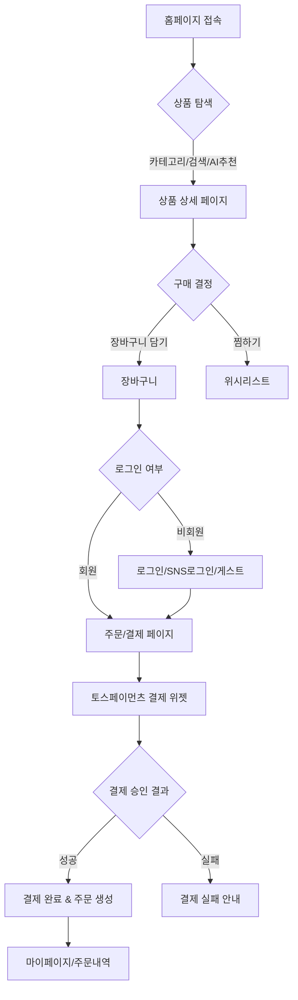
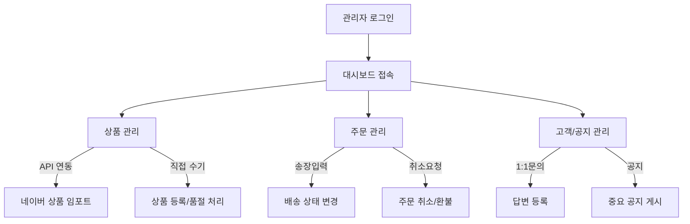

# HomeDeco Shop 프로젝트 문서

이 문서는 HomeDeco Shop 쇼핑몰 프로젝트의 주요 기술 스택, 워크플로우 및 데이터베이스 구조(ERD)를 설명합니다.

---

## 1. 주요 기술 스택 (Technical Stack)

본 프로젝트는 안정성과 확장성을 고려하여 다음 기술들을 활용하여 구축되었습니다.

### **Backend**
- **Language**: PHP (Vanilla PHP 8.x)
- **Database**: MySQL / MariaDB
- **Authentication**: Session 기반 인증, 소셜 로그인 (Naver Login API)

### **Frontend**
- **Language**: HTML5, CSS3, JavaScript (ES6+)
- **Libraries**: jQuery (일부 DOM 조작), Font Awesome (아이콘), Google Fonts (Typography)
- **Design Strategy**: Vanilla CSS 기반의 커스텀 테마 (Modern & Premium Aesthetic)

### **External APIs & Integrations**
- **Payment**: Toss Payments API (결제 위젯 및 승인 로직)
- **Search/Products**: Naver Shopping Search API (상품 데이터 동기화 및 이미지 수집)
- **Security**: SQL Injection 방지 (Prepared Statements), CSRF 보호

---

## 2. 워크플로우 (Workflow)

프로젝트의 주요 사용자 및 관리자 비즈니스 로직입니다.

### **2.1 사용자 워크플로우 (User Flow)**
1.  **탐색 (Discovery)**: 메인 페이지(`index.php`)에서 추천 상품, 카테고리별 상품, 신상품 검색.
2.  **로그인/가입 (Auth)**: 일반 회원가입 또는 네이버 소셜 로그인을 통한 간편 접속.
3.  **쇼핑 (Shopping)**: 상품 상세 정보 확인 후 장바구니(`cart.php`) 담기 또는 찜하기(`wishlist.php`).
4.  **주문/결제 (Checkout)**: 배송 정보 입력 후 토스페이먼츠를 통한 실시간 결제 진행.
5.  **사후 활동 (Post-Purchase)**: 마이페이지에서 주문 내역 확인, 상품 리뷰 작성(`write-review.php`) 및 문의 게시판(`qna.php`) 이용.

### **2.2 관리자 워크플로우 (Admin Flow)**
1.  **대시보드 (Monitoring)**: 전체 주문 통계, 매출 현황, 신규 문의 실시간 확인.
2.  **상품 관리 (Inventory)**: 상품 등록, 수정, 삭제 및 네이버 API를 이용한 상품 정보 대량 임포트.
3.  **주문 관리 (Order Ops)**: 결제 완료된 주문의 상태 변경(배송중, 배송완료) 및 취소 처리.
4.  **고객 응대 (CS)**: 고객 문의 사항(`inquiries`) 확인 및 답변 등록, 중요 공지사항 게시.


## 4. 핵심 기능 (Key Features)

- **AI 기반 취향 맞춤 추천**: 사용자의 선호 스타일/색상을 분석하여 개인화된 상품 추천.
- **실시간 결제 연동**: 토스페이먼츠 위젯을 통한 안전하고 빠른 결제 프로세스.
- **반응형 인터페이스**: 데스크탑과 모바일 기기에 최적화된 사용자 경험 제공.
- **관리자 최적화 도구**: 대시보드 통계 기능 및 대량 상품 관리 툴 제공.


## 5. 플로우차트 (Flowchart)

### **5.1 사용자 쇼핑 및 결제 프로세스**


### **5.2 관리자 운영 프로세스**


## 3. ERD (Entity Relationship Diagram)

데이터베이스의 주요 테이블 간의 관계입니다.

```mermaid
erDiagram
    users ||--o{ orders : "places"
    users ||--o{ cart : "adds_to"
    users ||--o{ wishlist : "saves_to"
    users ||--o{ reviews : "writes"
    users ||--o{ inquiries : "submits"
    
    categories ||--o{ products : "contains"
    
    products ||--o{ product_images : "has_multiple"
    products ||--o{ cart : "is_in"
    products ||--o{ wishlist : "is_in"
    products ||--o{ order_items : "sold_as"
    products ||--o{ reviews : "rated_by"
    
    orders ||--o{ order_items : "consists_of"
    orders ||--o? reviews : "reviewed_in"
    
    reviews ||--o{ review_images : "has_photos"
    
    inquiries ||--o{ inquiry_replies : "gets_answered_by"
    
    users ||--o| user_preferences : "defines"
    users ||--o{ recommendation_logs : "tracked_for"
    products ||--o{ recommendation_logs : "recommended_as"

    users {
        int user_id PK
        string email
        string password
        string name
        string phone
        text address
        boolean is_admin
        timestamp created_at
    }

    products {
        int product_id PK
        int category_id FK
        string name
        text description
        decimal price
        int stock
        string style_tag
        string color_tag
        string room_tag
        decimal rating
    }

    orders {
        int order_id PK
        int user_id FK
        decimal total_amount
        string status "pending, paid, shipped, etc"
        text shipping_address
        string payment_method
        timestamp created_at
    }

    inquiries {
        int inquiry_id PK
        int user_id FK
        string subject
        text message
        string status "pending, answered, closed"
        timestamp created_at
    }

    notices {
        int notice_id PK
        string title
        text content
        boolean is_important
        int view_count
        timestamp created_at
    }


